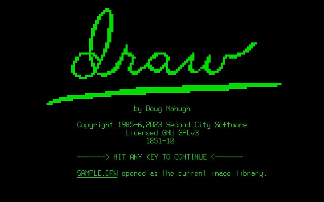

# scs-draw
This repository contains the executable program and related files for SCS-Draw (or simply "Draw"), the drawing program for early 1980s Kaypro CP/M microcomputers.

## History
I wrote SCS-Draw in 1985, and released it in November of that year as a shrink-wrapped mail-order program available from my new company Second City Software. It had an enthusiastic following in the first year or two after its release, and was featured on the cover of Profiles Magazine in March 1986. You can find more detailed information about the development and release of SCS-Draw in a blog post I wrote in 2013 entitled [SCS-Draw: teaching the Kaypro to draw](https://www.dougmahugh.com/scs-draw/).

This repo contains a GNU GPLv3 re-release of Draw, and the person who made that happen was **Harvey Patterson**.

Harvey reached out to me in early 2023 and asked if I'd be interested in releasing Draw as freeware. I said that sounded like a great idea, although I no longer had a copy of it in my own possession, because the copy I had kept was on old single-sided CP/M floppy disks that went bad some time around the turn of the century.

Harvey graciously provided his own copy to use for this project, and he has also provided all of the artifacts you'll find in this repo, which are now published under the GNU GPLv3 license. In addition to handling technical details such as updating the executable to a new copyright message and scanning the user guide and related materials, he patiently helped me get MAME up and running and taught me how to Draw myself for the first time in nearly 30 years.

Thank you, Harvey! The existence of this repo is a great gift to me, and I hope it brings some please to others in the Kaypro community as well.

The remainder of this README contains brief descriptions of the files you'll find in this repo. You can also find information about some of these files in the [blog post](https://www.dougmahugh.com/scs-draw/) mentioned above.

## File Descriptions

### DRAW.COM
This is the Draw 1.0 executable, which is a CP/M COM file. Note that it's labeled as GNU GPLv3 &mdash; this is the GPL release.

### SAMPLE.DRW
Draw shipped with a library of 26 sample images contained in this file, to show some of the capabilities of the program.

### SETDRAW.COM
This is a standalone executable that modifies DRAW.COM to specify a default printer from among the 10 supported dot-matrix and daisy-wheel printers.

### User's Guide.pdf
A scanned PDF of the 88-page printed user manual for Draw 1.0.

### User's Guide searchable.pdf
Fully searchable version of the user manual.

### User's Guide Addendum.png
A one-page addendum to the user guide that we mailed out to early users to address a few common issues.

### Update newsletter.pdf
A scanned copy of the first issue of the Second City Software newsletter. It includes a few examples of drawings people had created and mailed in, showing off what persons with much more drawing skill than me could accomplish with the program.

### package_art folder
Scanned images of the artwork for the slipcase that Draw shipped in.

### DRAW.IMD
A MAME image of Draw, for those who want to run it in the MAME emulator.

### GPL-declaration.txt
My declaration of the release of SCS-Draw as open source freeware under GNU GPLv3 on December 26, 2023.

### LICENSE
The GNU GPLv3 license file.